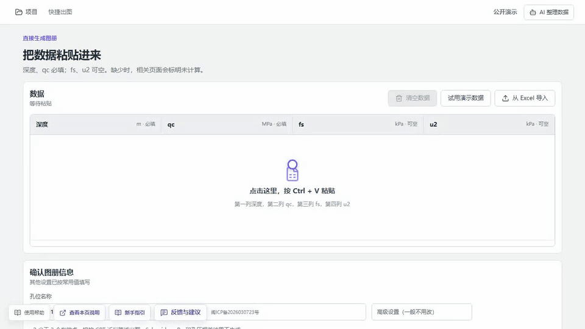
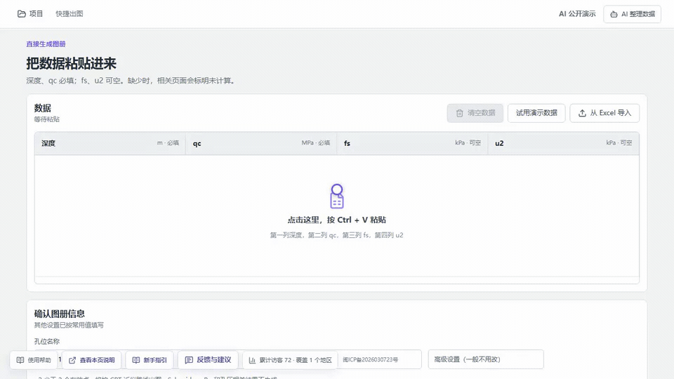
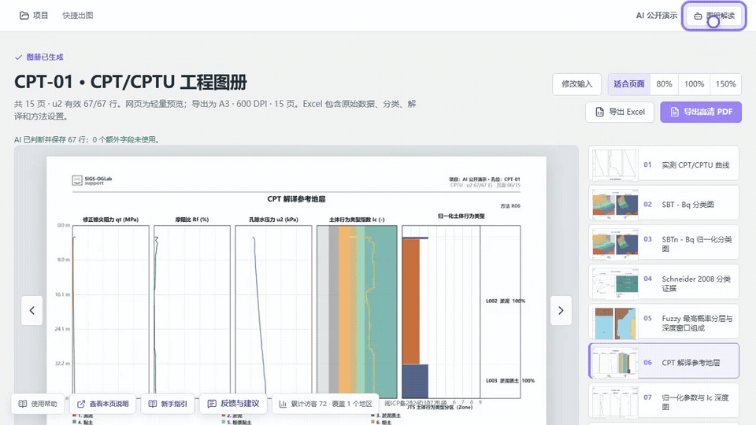

# SIGS-OGLab

面向 CPT/CPTU 数据的中文浏览器工作台，覆盖数据导入、快速出图、数据检查、地层分层、参数解译与成果导出。

- 在线使用（中国大陆）：[sigs-oglabx.com](https://sigs-oglabx.com)
- 在线使用（全球）：[sigs-oglab.com](https://sigs-oglab.com)
- 问题与建议：[GitHub Issues](https://github.com/shijie774302906/SIGS-OGLab/issues) 或 `sigsoglab@163.com`

> 本项目用于科研、教学和工程辅助。自动分类、参数结果和 AI 回复不能替代有资质工程师的复核与正式工程判断。

## 功能

- **快速出图**：粘贴或导入 CPT/CPTU 数据，生成中文工程图册与 Excel 结果。
- **专业解译**：以引导式流程完成导入、检查、地层分层、参数解译和成果输出。
- **AI 辅助**：使用 DeepSeek 协助识别工作表、表头和字段，并解释已经生成的图册。
- **水运工程场景**：内置 JTS/T 242—2020 相关分类工作流和可追溯的工程提示。
- **本地优先**：普通数据导入、绘图和解译默认在浏览器本地完成；只有主动调用 AI 时，当前任务所需内容才会发送至 AI 服务。

## 演示

### 快速出图



### AI 整理数据



### AI 解读图册



## 本地运行

要求：Node.js 20 或更高版本。

```bash
git clone https://github.com/shijie774302906/SIGS-OGLab.git
cd SIGS-OGLab
npm install
npm run dev
```

随后打开终端显示的本地地址。`npm run dev` 会同时启动 Vite 前端和本地 AI 转发服务；只开发前端时可使用 `npm run dev:web`。

## AI 配置

在线网站提供有限的公共 DeepSeek 调用额度。用户也可以在页面中临时输入自己的 DeepSeek API Key；Key 只应保留在当前会话中。

本地或自行部署时，也可在服务端环境变量中配置：

```env
DEEPSEEK_API_KEY=your_key_here
DEEPSEEK_BASE_URL=https://api.deepseek.com
DEEPSEEK_MODEL=deepseek-v4-pro
ASSISTANT_VISITOR_SECRET=replace_with_a_long_random_secret
```

不要把真实 Key 写入 `VITE_*` 变量、源代码、截图或版本库。完整示例见 [.env.example](.env.example)，CloudBase 部署说明见 [deploy/cloudbase/README.md](deploy/cloudbase/README.md)。

## 数据与隐私

- 项目数据默认存放在使用者自己的浏览器中。
- 普通导入、检查、绘图和参数计算不需要上传工程文件。
- 只有用户主动调用 AI 数据整理或图册解读时，完成该次任务所需的内容才会发送至 DeepSeek。
- 在线站点会记录去标识化的访问次数和地区汇总，用于了解网站使用情况；不将工程测量数据用于访问统计。
- 仓库只包含合成或公开许可的演示数据，不包含未授权工程样本。

## 验证

```bash
npm run build
npm run test:assistant-server
npm run test:e2e
```

浏览器测试基于 Playwright。首次运行前可执行：

```bash
npx playwright install chromium
```

## 参与贡献

欢迎提交 Issue、功能建议和 Pull Request。请不要在 Issue、测试附件或提交中上传真实 API Key、未脱敏工程数据或其他敏感材料。详见 [CONTRIBUTING.md](CONTRIBUTING.md) 与 [SECURITY.md](SECURITY.md)。

## 许可证

代码以 [MIT License](LICENSE) 开源。标准正文、书籍、论文、数据集和第三方资料仍分别受其原有版权或许可约束，本仓库不会因代码许可证而改变这些权利。
