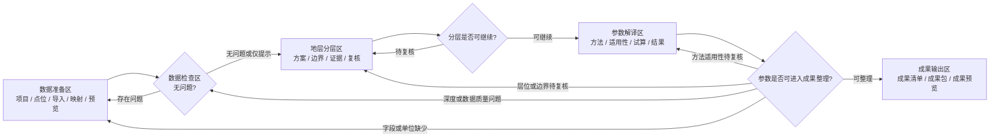
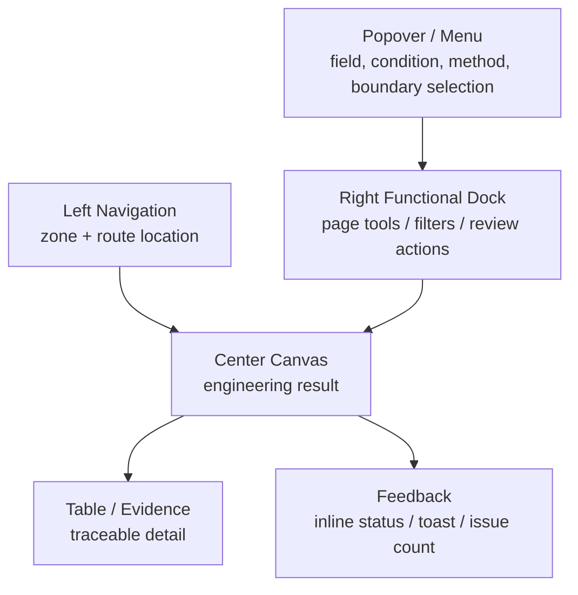

# Five Feature Zones Functional Blueprint

Date: 2026-07-09

Status: revised after right-dock product decision

Workspace: `D:\CPT-UIQA-WebPrototype`

Product: `SIGS-OGLab / 海上风电岩土勘察解译`

## 1. Purpose

This document turns the active `plan.md` into a fuller product-function plan.

It is meant to answer four questions before implementation continues:

- What are the five feature zones?
- What modules belong inside each zone?
- How does one zone hand off to the next?
- How do we avoid missing modules while keeping the flow coherent?

This is a planning and research deliverable only. It does not approve production formulas, formal persistence, formal adoption, or formal export.

## 2. Research Inputs

### Local Product Inputs

- `plan.md`: active five-zone functional blueprint.
- `plan-total.md`: long-term product framework.
- `src/workflowData.ts`: current route model, sample-data selectors, status labels, and current workflow states.
- `src/App.tsx`: current six-page implementation and right-panel pattern.
- `sample_data/`: current sample bundles for stratification, parameters, output, method-lab checks, and manual walkthrough CSVs.

Current implementation facts:

- The UI currently has six workflow pages:
  - `项目/点位数据`
  - `数据导入`
  - `数据检查`
  - `地层分层`
  - `参数解译`
  - `成果输出`
- The product model should now be expressed as five feature zones:
  - `数据准备区`
  - `数据检查区`
  - `地层分层区`
  - `参数解译区`
  - `成果输出区`
- The first two workflow pages should be grouped under `数据准备区` rather than merged in one risky implementation step.
- Existing UI copy still contains older issue-status wording in code. Future user-facing copy should use `无问题`, `存在问题`, `待复核`, `可继续`, and `已确认`.

### Mobbin / Mixpanel Inputs

The goal is not to copy Mixpanel's product analytics domain. The useful reference is its interaction grammar:

- left product navigation
- center report/result canvas
- page-specific right functional dock
- popovers for short selection tasks
- feedback through toasts, inline status, or small modals

Reference flows and screens:

- [Mixpanel - Creating a report flow](https://mobbin.com/flows/46ced5e4-fdc6-4bd5-b3d2-558ae7861806)
- [Mixpanel - Report condition flow](https://mobbin.com/flows/119b245f-160d-4308-bbb4-04403ceaf5a7)
- [Mixpanel - Saving a report flow](https://mobbin.com/flows/ecef60cb-f711-4875-b62c-89d6235a9e52)
- [Mixpanel report canvas screen](https://mobbin.com/screens/55fc4611-f390-44c5-a722-30c74789c6d2)
- [Mixpanel condition-control screen](https://mobbin.com/screens/08180303-f93d-460d-bc88-740ec1273525)
- [Mixpanel date/condition popover screen](https://mobbin.com/screens/f097d25f-a8b4-414a-8b85-370bd45ca9ec)
- [Mixpanel save/export feedback screen](https://mobbin.com/screens/86f675de-c4df-4dfb-a9eb-82a7202c0309)

Observed reference patterns:

| Reference Pattern | What Mixpanel Does | Product Adaptation |
| --- | --- | --- |
| Report creation | Start from an object, set conditions, show chart/table, then save or share. | Start from point/data, define engineering scope, show evidence/table, then move to next zone. |
| Condition selection | Keep the result canvas stable while condition controls appear in panel or popover. | Keep layer/parameter evidence visible while selected boundary, method, or issue details change. |
| Saving feedback | Commit actions use modal/toast without replacing the report surface. | Prototype-safe actions should use inline status or notes; do not imply formal save or export. |
| Right functional dock | Tools, conditions, review actions, and view settings live outside the main result. | Use the right side as a page-specific dock for current-page tools, not as a fixed status checker. |
| Evidence detail table | Chart gives trend/result; table gives traceable detail. | Evidence chart gives engineering visual; lower table gives layer/parameter/output traceability. |

## 3. Naming And Status Rules

Use this wording in new user-facing copy:

| Concept | Preferred Copy |
| --- | --- |
| Current step has no issue | `无问题` |
| Data or workflow issue exists | `存在问题` |
| Needs reviewer attention | `待复核` |
| Safe to advance | `可继续` |
| Confirmed review state | `已确认` |
| Candidate state | `候选` |
| Trial-only parameter result | `试算` |
| Read-only fixture | `只读样例` |
| Output needs more information | `待补全` |
| Output can be generated in the current workbench | `可生成` |
| Output has been generated in the current workbench | `已生成` |

Rules:

- Do not use severe engineering workflow words when the user only needs to know that the current step has `存在问题`.
- Keep `问题` separate from `提示`.
- Keep `待复核` separate from `存在问题`: a review task is not always a data problem.
- Keep `候选`, `试算`, `只读样例`, and `已确认` visually and semantically distinct.
- Do not imply formal save, formal adoption, production persistence, or formal export.
- For `成果输出区`, use natural product copy such as `查看成果清单`, `生成成果预览`, `可生成`, `待补全`, `已生成`, and `需确认`.
- Avoid user-facing action copy such as `正式导出`, `提交成果`, `采纳成果`, or `最终报告` until those flows are explicitly designed.

## 4. Five Feature Zones

| Zone | Feature Zone | User Question | Current Route Coverage | Primary Output |
| --- | --- | --- | --- | --- |
| 1 | 数据准备区 | 当前项目、点位、导入批次和字段是否准备好？ | 项目/点位数据 + 数据导入 | 标准化点位数据视图 |
| 2 | 数据检查区 | 数据是否存在问题，是否可以进入地层分层？ | 数据检查 | 检查结论与问题清单 |
| 3 | 地层分层区 | 当前分层方案、层位和边界是否可继续？ | 地层分层 | 分层方案与复核状态 |
| 4 | 参数解译区 | 当前分层能支持哪些参数试算？ | 参数解译 | 参数方案与试算结果 |
| 5 | 成果输出区 | 成果清单是否完整，哪些内容还需要补全或确认？ | 成果输出 | 成果清单与成果预览 |

Recommended IA decision:

- Keep six workflow pages in the near term.
- Group `项目/点位数据` and `数据导入` visually under `数据准备区`.
- This avoids a disruptive route rewrite while making the product model coherent.

## 5. Shared Object Lifecycle

Use this table as the coverage backbone. Every module should create, inspect, update, or consume at least one object here.

| Object | Created In | Consumed By | Key States | Evidence Surface |
| --- | --- | --- | --- | --- |
| 项目 | 数据准备区 | all zones | 已选择 / 需切换 | sidebar context, center header |
| 点位 | 数据准备区 | all zones | 已选择 / 缺少数据 / 可检查 | point table, footer context |
| 原始数据 | 数据准备区 | 数据检查区 | 已读取 / 字段不完整 / 可预览 | preview table |
| 导入批次 | 数据准备区 | 数据检查区 | 待映射 / 已映射 / 存在问题 / 可检查 | import panel, mapping table |
| 字段映射 | 数据准备区 | 数据检查区 | 待映射 / 已映射 / 存在问题 | mapping table, right detail |
| 检查问题 | 数据检查区 | 数据准备区, 地层分层区 | 无问题 / 存在问题 / 提示 / 已处理 | issue table, right detail |
| 分层方案 | 地层分层区 | 参数解译区, 成果输出区 | 候选 / 待复核 / 已确认 / 只读样例 | scheme list, chart, table |
| 分层边界 | 地层分层区 | 参数解译区 | 自动建议 / 人工修订 / 待复核 / 已确认 | boundary marker, right panel |
| 层位 | 地层分层区 | 参数解译区, 成果输出区 | 已选中 / 待复核 / 可继续 | layer track, layer table |
| 参数方案 | 参数解译区 | 成果输出区 | 可试算 / 待复核 / 试算完成 / 缺少输入 | parameter list, right panel |
| 参数结果 | 参数解译区 | 成果输出区 | 候选 / 试算 / 可整理 / 暂不整理 | parameter table |
| 成果包 | 成果输出区 | terminal preview | 待补全 / 可生成 / 已生成 / 需确认 | package manifest tree, readiness matrix, output table |

## 6. Cross-Zone Flow



Flow rules:

- A downstream zone must show why it depends on upstream data.
- A zone can send the user backward only with a concrete reason and target module.
- `存在问题` should identify the object and the affected next step.
- `待复核` should identify what must be reviewed and whether the next step is still allowed.
- `可继续` is a handoff state, not a final engineering approval.
- Parameter issues must return to the owning object, not always to stratification:
  - field/unit gaps -> `数据准备区`
  - depth sequence or data-quality issues -> `数据检查区`
  - layer/boundary review -> `地层分层区`
  - method applicability -> `参数解译区`

## 7. Global UI Model

Borrow Mixpanel's surface separation:



Surface ownership:

| Surface | Job | Should Not Do |
| --- | --- | --- |
| Left nav | Show feature zone and current route. | Explain engineering details or repeat all statuses. |
| Center header | Name the current result and primary action. | Carry long warnings or implementation notes. |
| Center canvas | Show chart, evidence, and table. | Become a settings form. |
| Right functional dock | Host page-specific tools, selections, filters, configuration, review actions, and generation conditions. | Become a second left navigation, duplicate the entire center table, or replace the primary evidence. |
| Popover/menu | Handle short choices. | Become a multi-step workflow. |
| Inline status/toast | Confirm lightweight feedback. | Imply formal persistence or export. |

### Layout Contract By Zone

This is the first-screen contract for later UI implementation. It keeps the prototype close to a mature Mixpanel-like workbench while staying focused on engineering evidence.

| Zone | Primary Evidence Surface | First Viewport Requirement | Right Functional Dock Role | Collapse Or Popover Content |
| --- | --- | --- | --- | --- |
| 数据准备区 | field mapping matrix + normalized preview table | selected project/point, mapping state, and preview rows are visible without scrolling | import batch, field mapping, unit/depth checks, field picker | source/batch selection, field picker |
| 数据检查区 | issue table + affected row/range evidence | issue summary and at least the first issue/evidence row are visible | rule groups, issue locator, repair suggestions, check scope | rule-group selector, issue category selector |
| 地层分层区 | depth evidence canvas + layer table | active scheme, depth track, and first layer rows are visible | scheme switcher, boundary review, evidence toggles, layer actions | scheme picker, evidence toggles |
| 参数解译区 | parameter result matrix + input dependency rows | active method/scheme, result rows, and applicability state are visible | method library, applicability conditions, parameter settings, trial scope | method selector, layer selector |
| 成果输出区 | readiness matrix + output table / manifest tree | readiness gate, included/excluded items, and preview status are visible | output template, list filter, generation conditions, source trace | output item selector, preview mode selector |

Layout rules:

- The center evidence surface must remain the visual anchor at `1440x900` and `1920x1080`.
- Right dock width should support current-page tools, not become a second data table.
- Repeated objects should use dense tables, matrices, trees, or compact lists rather than card grids.
- No card stacking inside page sections; use full-width workbench bands or unframed layouts for page structure.
- Popovers are for short choices only; anything with multi-step reasoning belongs in the center surface or right dock.

### Right Functional Dock Contract

The right side should not be a fixed status checker. It is a page-specific functional dock.

Shared dock rules:

- It may differ by page because each feature zone has different tools.
- It should host tools, selections, filters, configuration, review actions, and generation conditions.
- It should not become a second left navigation.
- It should not duplicate the center table.
- It should not hide or replace the center evidence surface.
- Every dock module must map to a clear action: select, filter, configure, review, locate, trace, or generate.
- State text is allowed as context for a tool, but state inspection is not the dock's main purpose.

Typical dock tools by zone:

| Zone | Dock Tool Examples |
| --- | --- |
| 数据准备区 | import batch, field mapping, unit checks, depth checks, field picker |
| 数据检查区 | rule groups, issue locator, repair suggestions, check scope |
| 地层分层区 | scheme switcher, boundary review, evidence toggles, layer actions |
| 参数解译区 | method library, applicability conditions, parameter settings, trial scope |
| 成果输出区 | output template, list filter, generation conditions, source trace |

### State Visual Coding Rules

| State | Visual Role | Placement Rule |
| --- | --- | --- |
| `无问题` | quiet success/clear state | header summary or row chip; explanatory copy may say `未见影响下一步的问题` |
| `存在问题` | light-red issue state | issue rows, right-panel reason, and handoff gate only |
| `待复核` | review state | selected object detail and table chip; not styled as a data issue unless it affects continuation |
| `可继续` | handoff state | near the primary action or gate, not as a final approval badge |
| `已确认` | scoped review confirmation | only beside the reviewed layer, boundary, or note |
| `候选` / `试算` / `只读样例` | prototype-safety states | always visible on schemes, parameter results, and sample outputs |

## 8. Feature Zone Modules

### 8.1 数据准备区

Purpose:

- Establish current project, point, data source, import batch, mapping, unit/depth contract, and preview readiness.

Modules:

| Module | Consumes | Main Action | Center Surface | Right Panel | Produces |
| --- | --- | --- | --- | --- | --- |
| 项目/点位选择 | project/point metadata | select point | point inventory table | selected point summary | current project/point |
| 数据覆盖摘要 | source stats | inspect coverage | compact metric row | coverage explanation | coverage judgment |
| 导入批次 | local sample files | select batch | batch list / source info | batch detail | active import batch |
| 字段映射 | source columns | map/check fields | mapping table | selected field detail | mapping result |
| 必要字段与单位契约 | source columns + units | inspect CPT/CPTU channels | field/unit matrix | channel impact detail | required-channel contract |
| 深度基准与范围 | depth, water depth, final depth | inspect depth basis | depth-range strip + preview rows | depth-basis detail | depth readiness |
| 数据预览 | source rows | inspect rows | preview table | selected row/field | normalized preview |
| 导入提示 | mapping + preview | locate issue candidate | hint chips/table | hint explanation | issue candidates |

States:

- `未选择点位`
- `已选择点位`
- `字段待映射`
- `存在问题`
- `可检查`

Handoff to 数据检查区:

- project
- point
- import batch
- field mapping
- normalized preview
- issue candidates

Primary action:

- `运行数据检查`

Acceptance checks:

- User can identify the current project and point in under 5 seconds.
- User can see whether fields are mapped and preview rows are readable.
- User can identify whether data can enter checking.
- User can see depth unit `m`, monotonic depth readiness, water depth, and final depth status.
- User can see `Qc/Qt/Fs/U2` units, `Fr` expression, and the downstream impact of any missing channel.

### 8.2 数据检查区

Purpose:

- Decide whether prepared data can enter analysis and explain any issue with evidence.

Modules:

| Module | Consumes | Main Action | Center Surface | Right Panel | Produces |
| --- | --- | --- | --- | --- | --- |
| 规则组概览 | normalized data | inspect check groups | metric row | rule group details | check summary |
| 必检契约 | normalized data + unit/depth contract | inspect mandatory CPT/CPTU checks | contract matrix | failed contract detail | mandatory-check summary |
| 问题清单 | check results | select issue | issue table | issue detail | selected issue |
| 问题定位 | selected issue | locate affected data | row/range highlight | affected object | evidence context |
| 修复建议 | issue detail | decide next action | issue action text | recommended action | action target |
| 进入分层判断 | all checks | continue or return | status strip | dependency note | can continue / needs action |
| 检查记录 | check run | inspect history | compact log row | notes tab | check history |

States:

- `未检查`
- `无问题`
- `存在问题`
- `仅提示`
- `可进入分层`

Handoff to 地层分层区:

- point data
- check summary
- issue notes
- permitted analysis scope

Primary action:

- `进入地层分层`

Acceptance checks:

- User can separate `存在问题` from `仅提示`.
- User can see which issue prevents or affects the next step.
- User can return to the exact data-preparation module if needed.
- Required checks cover depth unit `m`, increasing depth sequence, source channel units, `Fr` percentage/dimensionless expression, water depth, final depth, and missing-channel impact.

### 8.3 地层分层区

Purpose:

- Compare layer schemes, inspect evidence, review boundaries, and clarify whether a scheme can continue to parameter interpretation.

Modules:

| Module | Consumes | Main Action | Center Surface | Right Panel | Produces |
| --- | --- | --- | --- | --- | --- |
| 分层方案列表 | layer scheme bundle | select scheme | control row / right list | scheme detail | selected scheme |
| 分层画布 | selected scheme | inspect layers | depth track + evidence chart | selected layer/boundary | visual evidence |
| 边界复核 | boundary refs | select boundary | boundary marker | boundary detail | review state |
| 层位表 | selected scheme | select layer | evidence detail table | layer detail | selected layer |
| 证据图表模式 | evidence refs | inspect SBTn/cues | chart mode inside depth canvas | chart tab | evidence context |
| 复核注释 | selected object | draft note | optional inline mark | notes tab | note draft |

States:

- `只读样例`
- `候选`
- `待复核`
- `可继续`
- `已确认`

Handoff to 参数解译区:

- selected scheme
- layer table
- boundary review state
- notes/issues relevant to parameter trial

Primary action:

- `进入参数解译试算`

Acceptance checks:

- User can see which scheme is active.
- User can see which boundary or layer is selected.
- User can see why a scheme is `待复核` or `可继续`.
- Evidence charts show depth increasing downward with unit `m`.
- Qtn is treated as dimensionless, `Fr` is clearly marked as percent or dimensionless, and SBTn cues are presented as evidence or hints, not official classification when formulas are not connected.

### 8.4 参数解译区

Purpose:

- Select trial methods, check applicability, inspect parameter results, and keep trial/candidate states separate from formal output.

Modules:

| Module | Consumes | Main Action | Center Surface | Right Panel | Produces |
| --- | --- | --- | --- | --- | --- |
| 参数方案列表 | parameter schemes | select scheme | selected scheme summary | scheme switcher + detail | selected parameter scheme |
| 方法选择 | selected layer + method catalog | choose method | compact selector/table | method detail | selected method |
| 适用性检查 | layer class + method rules | inspect applicability | inline state/table tag | applicability detail | applicability result |
| 参数结果表 | method run fixture | select result | parameter table | result detail | selected parameter slot |
| 输入依赖 | selected result | trace source | dependency row | source layer/boundary | dependency context |
| 试算提示 | method assumptions | inspect warning | issue row/chip | warning explanation | warning notes |

States:

- `可试算`
- `缺少输入`
- `待复核`
- `试算完成`
- `可整理`
- `暂不整理`

Handoff to 成果输出区:

- parameter scheme
- parameter result candidates
- preview eligibility state
- assumptions/warnings

Primary action:

- `查看成果预览`

Acceptance checks:

- User can distinguish method applicability from method result.
- User can see whether a result is `试算`, `候选`, or `可整理`.
- User is not led to believe formal interpretation is complete.

### 8.5 成果输出区

Purpose:

- Preview package readiness, show what is included/excluded, and make prototype export limits explicit.

Modules:

| Module | Consumes | Main Action | Center Surface | Right Panel | Produces |
| --- | --- | --- | --- | --- | --- |
| 成果清单状态 | layer + parameter states | inspect readiness | gate matrix | dependency detail | readiness summary |
| 成果清单 | output package fixture | select item | output table | selected item detail | selected output item |
| 成果包结构 | report manifest | inspect package | manifest tree / readiness matrix | manifest detail | package preview |
| 排除项 | candidate/trial/debug objects | inspect exclusion | exclusion chips/table | reason detail | exclusion clarity |
| 引用链路 | selected output item | trace source | trace row | source dependency | traceability |
| 生成边界 | product boundary | inspect limitation | inline notice | limitation detail | safe expectation |
| 成果预览 | preview-eligible sample data | preview content | preview panel | notes/metadata | preview only |

States:

- `待补全`
- `可生成`
- `已生成`
- `需确认`

Primary action:

- `检查成果清单`

Acceptance checks:

- User can see what can be previewed.
- User can see what cannot enter deliverables and why.
- Formal export remains clearly unavailable.
- Any parameter shown in the output zone is marked as preview-eligible sample data, not formal deliverable input.

## 9. Handoff Contract Template

Every implementation module should be defined before coding:

```text
Module:
Consumes:
Produces:
Main user action:
Visible state:
Issue state:
Right-dock module:
Next zone dependency:
Acceptance check:
Prototype safety note:
```

Example:

```text
Module: 边界复核
Consumes: selected layer scheme, boundary evidence refs
Produces: selected boundary review state
Main user action: select boundary interval
Visible state: 待复核 / 可继续 / 已确认
Issue state: 存在问题 only if review prevents the next step
Right-dock module: boundary focus, evidence toggle, review note
Next zone dependency: 参数解译 needs usable layer boundaries
Acceptance check: selecting a boundary updates chart, table, and right panel consistently
Prototype safety note: does not imply formal adoption
```

## 10. Coverage Method

Before implementing a slice, run these checks:

| Check | Question | Failure Signal |
| --- | --- | --- |
| Object lifecycle | Which object is created, inspected, updated, or consumed? | Module is just a UI surface without data responsibility. |
| Engineering question | What user question does it answer? | Module is decorative or redundant. |
| State clarity | Are `无问题`, `存在问题`, `待复核`, and `可继续` represented correctly? | User cannot tell why the next action is allowed or delayed. |
| Handoff | What goes to the next zone? | Downstream page repeats work or invents missing context. |
| Evidence | What proves the result? | Status appears without table/chart/detail support. |
| Surface ownership | Is it left nav, center canvas, right dock, popover, or feedback? | Same function appears in multiple places. |
| Prototype safety | Does copy imply save, adoption, official calculation, or export? | User may believe the prototype is production behavior. |

## 11. Recommended Implementation Roadmap

### Slice A - IA And Wording Lock

Goal:

- Lock the five-zone model and remove old issue wording from user-facing UI.

Scope:

- Keep six workflow pages but group the first two under `数据准备区`.
- Update left nav grouping, page headers, right-panel titles, and metric labels.
- Replace current labels such as old severe issue terms with `问题` wording.

Acceptance:

- Left navigation and headers clearly communicate five zones.
- New user-facing copy uses `无问题`, `存在问题`, `待复核`, `可继续`, and `已确认`.
- Current workflow order remains intact.

### Slice B - Right Functional Dock Contract

Goal:

- Define the right side as a page-specific functional dock, not a fixed status checker.

Scope:

- Establish shared dock boundaries:
  - not a second workflow navigation
  - not a duplicate center table
  - not a replacement for primary evidence
  - every dock module has a clear action
- Define page-specific dock tool families:
  - 数据准备区: field mapping, unit checks, import batch selection, field picker
  - 数据检查区: rule groups, issue locator, repair suggestions, check scope
  - 地层分层区: scheme switcher, boundary review, evidence toggles, layer actions
  - 参数解译区: method library, applicability conditions, parameter settings, trial scope
  - 成果输出区: output template, list filter, generation conditions, source trace

Acceptance:

- Right dock content is page-specific and action-oriented.
- Status copy appears only as context for a tool.
- Right dock does not repeat the center table or act as a second left nav.

### Slice C - 数据准备区 Deepening

Goal:

- Make project/point selection, import batch, mapping, preview, and issue candidates feel like one preparation workflow.

Acceptance:

- User can answer: what point is selected, what data is loaded, what fields are mapped, and can it be checked?

### Slice D - 数据检查区 Deepening

Goal:

- Make issue detection, location, and next-step eligibility clearer.

Acceptance:

- User can see whether the dataset is `无问题`, `存在问题`, or `仅提示`.
- Each issue has source, detail, and suggested next action.

### Slice E - 地层分层区 And 参数解译区 Handoff

Goal:

- Make the layer scheme to parameter trial handoff explicit.

Acceptance:

- Parameter trial clearly depends on selected layer scheme and review state.
- Candidate/trial/confirmed states remain separate.

### Slice F - 成果输出区 Readiness

Goal:

- Make output preview readiness and exclusions explicit.

Acceptance:

- User can see what can be previewed, what cannot enter deliverables, and which upstream object must be reviewed.

## 12. Agent Review Summary

Read-only agent review was completed with:

- `visual-layout-taste-auditor`
- `geotechnical-domain-reviewer`
- `copy-ia-mobbin-challenger`

Review result:

- No P0 findings.
- P1 findings were integrated into this document and `plan.md`.
- Detailed review record: `docs/prototype/five-feature-zones-agent-review-2026-07-09.md`.

Integrated review themes:

- Layout contract and primary evidence surfaces are now explicit.
- Parameter/output states are constrained to preview/trial language.
- CPT/CPTU unit, depth, water-depth, final-depth, and missing-channel contracts are explicit.
- Parameter fallback paths now return to the owning zone.
- Mixpanel reference is kept as interaction grammar, while implementation-facing terminology stays domain-native.

## 13. Open Questions

### Q1. Should the left sidebar show exactly five top-level zones?

Recommended answer:

- No, not immediately.
- Keep six workflow pages, grouped into five feature zones.
- Reason: existing routes already support detailed screens; grouping avoids a route rewrite while improving IA.

### Q2. Should `数据准备区` become a single combined page?

Recommended answer:

- Not in the first slice.
- First visually group and align copy. Later decide whether a combined preparation page improves efficiency.

### Q3. Should warning and issue taxonomy become a shared data model?

Recommended answer:

- Yes, but after IA wording is locked.
- Start by standardizing visible copy and then refactor internal data names if needed.

## 14. Readiness To Implement

Implementation may start if:

- Slice A remains verified.
- The next slice starts with `Slice B - Right Functional Dock Contract`.

Current recommendation:

- Start `Slice B - Right Functional Dock Contract` with a confirmation card before implementation.
