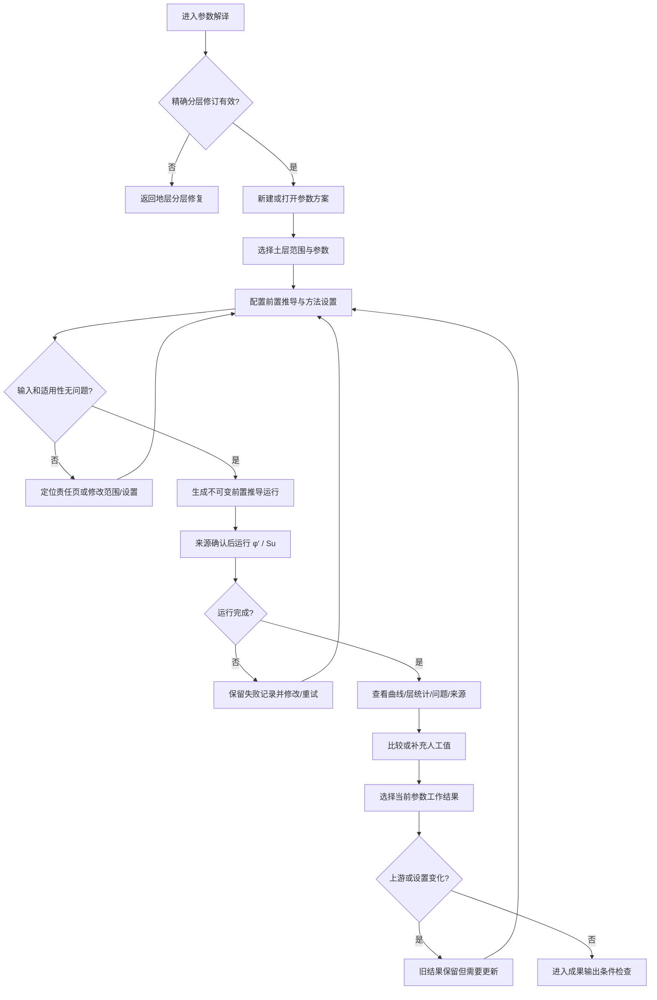

# 参数解译 G0 调研与功能合同

日期：2026-07-10  
状态：`G0 调研完成 / G1A+G1C 已实现 / G1B 来源合同复查中`  
适用阶段：`Stage G / 参数解译`

> G1B 来源核验已形成 `docs/prototype/参数解译G1B公式来源与方法合同.md`。该合同以可定位出版物为依据，取代本文对 `φ′/Su` 的候选假设。尤其注意：`suc` 不再以 `Ic >= 2.60` 作为硬门槛；`Nkt=12` 不再自动写入；所有数值旁必须显示峰值/三轴压缩参考限定。

## 1. 本文解决什么

本文先把参数解译的产品对象、公式边界、前置输入、页面模块、异常恢复和验收证据统一，再进入实现。它不等于公式授权，也不把桌面参考中的规划样例当成网页已经具备的能力。

本阶段的真实目标是：

```text
用户从当前点位的精确分层修订进入参数解译
-> 明确可处理的土层、参数和方法
-> 透明地产生方法所需前置量
-> 配置并运行参数计算
-> 查看逐深度结果、层内统计、问题和来源
-> 选择当前参数工作结果
-> 将精确来源交给成果输出条件检查
```

## 2. 调研范围与证据等级

### 2.1 已核对的本地来源

- 桌面实现：`D:\CPT-UIQA\OffshoreGeotechWorkbench\Services\CptuParameterInterpretationService.cs`
- 桌面首轮解译：`D:\CPT-UIQA\OffshoreGeotechWorkbench\Services\CptuInterpretationService.cs`
- 输入设置：`D:\CPT-UIQA\OffshoreGeotechWorkbench\Models\InterpretationInputSettings.cs`
- 参数设置：`D:\CPT-UIQA\OffshoreGeotechWorkbench\Models\CptuParameterInterpretationSettings.cs`
- 本地公式规格：`D:\CPT-UIQA\公式规格说明.md`
- 参数工作台蓝图与数据合同：`D:\CPT-UIQA\docs\gmw-p2-parameter-workbench-blueprint.md`、`gmw-p2-parameter-scheme-data-contract.md`
- 方法注册与 Method Lab 合同：`gmw-p3-method-registry-capability-contract.md`、`method-lab-json-contract.md`
- 网页现状：`src/App.tsx`、`src/workflowData.ts`、`sample_data/parameters/yingkou-cpt09-parameter-scheme-bundle.v1.json`

### 2.2 证据等级

| 等级 | 含义 | 本轮处理 |
| --- | --- | --- |
| 已实现 | 桌面服务中存在真实计算和状态判断 | 可作为待确认的网页实现候选 |
| 合同规划 | 文档或 fixture 中有对象和 UI 规划，但没有真实公式实现 | 只用于产品结构，不宣称可计算 |
| 研究方法 | Groundhog、pyCPT 或 Method Lab 等研究能力 | 与主工作流隔离，不进入默认方法选择 |
| 未确认 | 公式、校准或输入合同不完整 | 不实现、不生成结果 |

## 3. 首批方法清单

### 3.1 桌面中已有真实实现候选

| 参数 | 方法 ID | 计算 | 必需输入 | 适用判断 | 可配置项 | 桌面实现记录 |
| --- | --- | --- | --- | --- | --- | --- |
| 峰值有效摩擦角 `φ′p` | `CPTU-Param-PhiSand-Qtn-Mayne` | `φ′p = 17.6 + 11.0 × log10(Qtn)` | `Qtn`、`IcRW`、速率/排水/材料证据 | `20 < Qtn < 400`、`IcRW < 2.60`、标准速率及来源范围成立 | 适用性证据修订 | ConeTec 2023 Rev1.1 p82 Eq.5.6 / p84，方法版本 `v1` |
| 三轴压缩参考不排水强度 `suc` | `CPTU-Param-Su-Nkt-MayneLunne` | `suc = qnet / Nkt` | `qnet`、结构化 `Nkt` 依据、速率/不排水/材料证据 | 黏土层、`qnet > 0`、独立不排水依据；`Ic` 仅为冲突证据 | `Nkt` 假设或场地校准修订 | ConeTec 2023 Rev1.1 p113 Eq.6.7，方法版本 `v1` |

桌面实现将每个深度行区分为：`Valid`、`NotApplicable`、`InvalidInput`、`InvalidMethodParameter`。网页应翻译为清晰的人类状态，例如“有效”“不适用”“输入存在问题”“方法参数存在问题”，不能把这些状态混为一个失败计数。

重要边界：现有 `公式规格说明.md` 仍不覆盖 `φ′p/suc`；G1B 的来源、适用性和方法合同由新增 G1B 文档单独承担。桌面服务只能作为旧行为参考，不能覆盖出版物限制。

`Nkt = 12` 是当前桌面默认，但网页不会自动写入。用户必须显式选择文献起始假设、用户自定义假设或结构化场地校准；三者的来源语义不得混用。

### 3.2 只有规划、没有可执行公式的项目

| 参数或方法 | 当前证据 | 决定 |
| --- | --- | --- |
| 单位重 `γ` | fixture 中只有项目默认值规划，没有已确认公式 | 不进入首批计算 |
| `OCR` | fixture 中标记为未来能力，缺 `Bq` 与校准合同 | 不进入首批计算 |
| Groundhog / pyCPT | Method Lab 研究合同，要求运行时、许可证和输入哈希等来源 | 研究区保留，不进入主方法选择 |
| 用户自定义公式 | 调试/研究模板 | 本阶段不开放 |

因此，首批真实参数只建议实现 `φ′` 与 `Su`。后续参数应重复本合同的覆盖流程，不能只在界面中增加一个名称和输入框。

## 4. 必须先解决的前置输入

网页导入数据当前可提供 `depth/qc/qt/fs/u2/Fr` 等字段，但不能直接提供可追溯的 `qnet/Qtn/Ic`。若参数页直接使用隐藏默认值生成这些量，用户无法知道结果来自哪里，也无法在上游变化后准确判断失效。

建议新增独立对象 `ParameterInputDerivationRunV2`，先透明地产生参数方法需要的前置量，再由 `φ′` 与 `Su` 运行消费它。

### 4.1 前置推导候选公式

以下是桌面首轮解译的本地实现事实，仍需用户确认是否作为网页前置推导 `v1` 的实现依据：

```text
qt = 已导入 qt
  或 qc + (1 - a_net) × u2

sigma_v0 = WaterDepth × gamma_w + z × gamma_t
u0 = (WaterDepth + z) × gamma_w
sigma'_v0 = max(MinEffectiveStress, sigma_v0 - u0)
qnet = qt - sigma_v0
Fr = 100 × fs / qnet
Qtn = (qnet / pa) / (sigma'_v0 / pa)^n
Ic = sqrt((3.47 - log10(Qtn))^2 + (1.22 + log10(Fr))^2)
n = min(1, 0.381 × Ic + 0.05 × (sigma'_v0 / pa) - 0.15)
```

为唯一复现桌面结果，候选算法顺序固定为：

```text
n = 1.0
repeat exactly IterationCount times:
  Qtn = (qnet / pa) / (sigma'_v0 / pa)^n
  if Qtn <= 0 or Fr <= 0 or any operand is non-finite: row = Undefined; stop
  Ic = sqrt((3.47 - log10(Qtn))^2 + (1.22 + log10(Fr))^2)
  n = min(1.0, 0.381 × Ic + 0.05 × (sigma'_v0 / pa) - 0.15)
return Qtn and Ic produced inside the last completed iteration
```

最后更新得到的 `n` 不再触发额外一次 `Qtn/Ic` 计算。若未来改为收敛迭代，必须创建新算法版本，不能静默改变 `v1`。

桌面默认设置：

| 设置 | 默认值 | 推荐网页有效域与处理 |
| --- | --- | --- |
| 净面积比 `a_net` | `0.80` | `[0.35, 0.95]`；设备假设，记录校准来源；只影响派生 `qt` 的行 |
| 土总重度 `gamma_t` | `18.0 kN/m³` | `[12, 24]`；首轮应力归一化假设 |
| 水重度 `gamma_w` | `10.05 kN/m³` | `[9.5, 10.5]` |
| 大气压 `pa` | `100 kPa` | `[80, 120]` |
| 最小有效应力 | `5 kPa` | `[1, 25]`；数值稳定假设，逐行记录是否触发 |
| 迭代次数 | `4` | 整数 `[2, 8]`；算法版本的一部分 |
| 水深 | 来自当前点位 | `m`，有限且 `>=0`；缺失或非法时停止运行，不默认成 `0` |

上述范围来自桌面当前输入归一化代码。网页推荐采用“输入存在问题并停止运行”，不做隐藏截断或默认回退；用户显式恢复默认值后才可运行。`Ic=2.60` 在首版固定为软件适用性筛选值，不开放任意编辑，直到方法来源合同确认其可配置范围。

### 4.2 单位、坐标与逐行来源合同

- `z` 为海床以下向下为正的贯入深度，单位 `m`。
- `WaterDepth` 为海面到海床的非负距离，单位 `m`；`0` 表示海床与当前水面基准重合，基准面必须来自点位数据。
- 进入公式前，`qc/qt/u2/fs/qnet/sigma/pa` 全部归一化为 `kPa`。
- `gamma_t/gamma_w` 使用 `kN/m³`，`Fr/Qtn/Ic/n` 无量纲，`φ′` 为度，`Su` 为 `kPa`。
- 每个归一化值记录源字段、源单位、换算规则、源行 ID 和换算后值。
- 导入 `Fr` 只作为核对证据；前置推导始终从归一化 `fs/qnet` 重新计算 `Fr`，二者差异单独提示，不把导入 `Fr` 当作计算输入。
- 导入 `qt` 只有在有限且 `>0` 时才可直接使用。缺失时允许由有效 `qc/u2/a_net` 推导；若导入 `qt` 存在但非法，默认报告问题，不静默回退。用户可显式选择“对非法 qt 使用派生值”策略，该策略进入设置快照。
- 每行保存 `qtSource = imported | derived`、`floorApplied`、实际消费的设置和所有中间量。

### 4.3 推荐处理

1. 前置推导是单独的不可变运行，不藏在某个参数方法内部。
2. 设置保存在参数方案中；每次运行保存完整设置快照和配置哈希。
3. 修改任何设置后，旧前置推导和消费它的参数运行保留，但标记为需要更新。
4. 用户可在运行前看到“使用了哪些输入、哪些是假设、哪些行无法计算”。
5. 导入 `qt` 的使用与回退严格遵循上方逐行来源合同；两条路径都不满足时该行存在问题。

## 5. 分层土类与 Ic 的职责

Stage F 已经产生用户确认过的工程土类与精确分层修订；桌面参数服务则仅用 `Ic = 2.60` 进行逐行适用性判断。网页不能让计算得到的 `Ic` 静默覆盖用户分层。

推荐组合规则：

1. 分层中的 `engineeringSoilGroup` 负责给出方法推荐和工程审查状态，不静默覆盖逐行计算。
2. `IcRW=2.60` 对 `φ′p` 是来源适用边界；对 `suc` 仅是软件冲突证据，不能反向证明排水状态。
3. `sand` 层推荐 `φ′p`，`clay` 层推荐 `suc`，但两者均需独立速率、排水和材料证据；推荐不等于可运行。
4. 工程土类与逐行 `Ic` 或排水证据冲突时，先创建 `SoilClassBehaviorScreenConflict` 并停止两种方法。用户从联合证据视图解决冲突后形成新修订，不自动切换方法。
5. `mixed/unknown` 层可查看输入与适用性证据，但在拆层、修改工程土类或明确排除前，不能进入当前参数工作结果。
6. 每个纳入范围的目标层必须至少有一个有效行，且不能含输入或方法参数问题；否则该参数成员不能进入当前结果。其余不适用行允许保留，并形成提示与覆盖率。

该规则同时保留人工分层审查和软件逐行筛选，并避免制造无来源数值。最低有效行规则只用于原型工作结果完整性，不代表工程统计充分性。

## 6. 完整产品对象

### 6.1 `ParameterWorkspaceV2`

每个点位独立拥有一个参数工作区：

- `pointId`
- 参数方案集合
- 当前打开方案 ID
- 当前参数工作结果引用
- 页面草稿与恢复信息
- 与其他点位完全隔离的运行和历史

### 6.2 `ParameterSchemeV2`

完整生命周期：新建、打开、切换、复制、重命名、删除、空状态、配置状态、存在问题、运行历史、需要更新和恢复。

核心字段：

- `schemeId`、`name`、`pointId`
- 精确上游来源链
- 作用范围与参数槽集合
- 前置推导设置
- 当前运行引用
- 创建和修改时间

方案生命周期规则：

- 名称在同一点位内忽略大小写后唯一；重名时不提交。
- 复制默认只复制当前方案修订的范围、参数槽和设置，不复制运行历史、当前结果引用或人工值；新对象使用全新 ID。
- 删除采用软删除；不可变运行和来源仍可审计。删除当前方案后切换到最近使用的有效方案；删除最后一个方案后进入无方案状态。
- 删除、恢复、重命名和复制均为原子提交；取消操作不改变 canonical 状态。
- 配置编辑形成 `ParameterSchemeDraftV2`；提交产生新的不可变 `parameterSchemeRevisionId`，放弃回到原修订。

### 6.3 `ParameterSlotV2`

一个参数槽回答“哪些层，用哪个方法，产生哪个参数”：

- 参数 ID、符号、单位
- 目标土层、深度范围和排除范围
- 方法 ID、方法版本和公式引用
- 必需输入及单位
- 方法设置
- 适用性规则
- 逐行结果与层内统计输出模式

参数槽支持新增、复制、编辑、删除、撤销和重做。复制只复制配置，不复制运行引用。范围采用 `[depthFrom, depthTo)`，当前点位最终深度允许作为闭合终点；排除区间先归一化并禁止相互重叠。空范围、范围越界或全部被排除时不能运行。

一个槽一次产生一个参数运行。批量运行只是对多个可运行槽发出独立命令：某槽失败不删除其他槽的成功运行，但包含必需槽的当前结果集合必须等所有必需槽满足完整性条件后才能建立。

### 6.4 不可变运行对象

- `ParameterInputDerivationRunV2`：生成 `qt/sigma_v0/u0/sigma'_v0/qnet/Fr/Qtn/Ic`。
- `ParameterRunV2`：消费一个精确的前置推导运行和精确的分层修订。
- `ParameterValueV2`：保存逐深度值、状态、原因和来源行。
- `ParameterLayerStatisticV2`：保存某层内的有效数、无效数、最小值、最大值、均值和中位数；不把统计量称为设计值。
- `ManualParameterEntryV2`：单独保存人工值、单位、范围、原因和来源，不覆盖计算结果。

重新运行追加新运行，不改写历史运行。

人工值采用修订生命周期：创建、编辑、删除均追加版本；单位换算保存原值、原单位、换算规则和标准单位值。人工值与计算值范围重叠时显示来源冲突，用户必须在当前结果集合中明确选择一个来源，系统不得自动覆盖。上游精确修订变化时人工值同样需要更新。

### 6.5 `ParameterResultSelectionV2`

“当前参数工作结果”不是单次运行，而是一个不可变、可版本化的结果成员集合：

```text
selectionId + selectionRevisionId
parameterSchemeId + parameterSchemeRevisionId
pointId + sourceLineageHash
members[]:
  slotId
  sourceType = calculated | manual
  parameterRunId 或 manualEntryRevisionId
  targetScopeSnapshot
  coverageSummary
issues + notices
createdAt
```

同一个结果集合中的所有成员必须绑定相同的点位、分层修订、前置推导运行和单位合同。每个必需槽必须有且只能有一个被选来源；每个目标层至少有一个有效值，无未解决的输入或方法参数问题，`mixed/unknown` 已修正或被明确排除。逐行“不适用”可保留为提示，但零有效值的目标层不得进入集合。

`ParameterWorkspaceV2.currentResultSelectionRef` 只指向一个精确 `selectionId + selectionRevisionId`。切换方案不会自动改写该引用；若来源与新方案不一致则显示需要更新。新增人工值、修改成员或替换运行都会产生新的 selection revision。

### 6.6 两阶段运行与事务合同

两类运行各自使用状态机：

```text
queued -> running -> completed
                  -> failed
                  -> cancel_requested -> cancelled
```

- 每次命令先原子保存输入快照、精确来源、算法/方法版本、设置哈希和 `idempotencyKey`，再进入运行。
- 运行值、层统计和完成状态在同一个事务中提交；失败或取消运行不得留下可被读取为完成结果的部分值。
- 已成功的前置推导运行不会因后续参数运行失败而回滚；若输入哈希、算法版本和来源完全一致，后续重试可显式复用它。
- “重试”沿用原命令的 `idempotencyKey`，网络或保存重试不得重复提交；用户主动“重新运行”创建新的运行 ID 和新 key。
- 失败/取消的命令记录可保留状态、错误和时间，但没有结果成员资格。
- 若取消请求与完成提交竞态：完成事务先提交则状态为 `completed`；否则为 `cancelled`。页面始终以数据库最终状态为准。
- 两阶段流水线不承诺跨两个运行的总事务；“无部分写入”分别约束每个运行自身，并由结果集合完整性防止半套结果交接。

### 6.7 精确来源链

每个参数运行至少绑定：

```text
projectId
pointId
importDraftId + importDraftRevisionId
batchId + batchRevisionId
mappingRevisionId
unitDecisionRevisionId
pointDecisionRevisionId
checkRunId
stratificationSchemeId + sourceStratificationRevisionId
parameterInputDerivationRunId
parameterSchemeId + parameterSchemeRevisionId
slotConfigSnapshot + targetScopeSnapshot
derivationAlgorithmId + derivationAlgorithmVersion + formulaSpecHash
methodId + methodVersion
settingsSnapshot + settingsHash
normalizedInputRows + sourceRowIds
qtSourcePolicy + perRowQtSource + floorApplied
```

任一上游精确修订改变，旧运行仍可查看，但不得继续作为当前参数工作结果或成果输出输入。

### 6.8 成果输出交接合同

Stage G 只创建交接 payload，不生成正式文件：

```text
ParameterHandoffV2
  projectId + pointId
  resultSelectionId + resultSelectionRevisionId
  parameterSchemeId + parameterSchemeRevisionId
  sourceLineageHash
  members[] + coverageSummary
  unresolvedIssueCount + noticeCount
  createdAt
```

成果输出页接收后必须重新读取 canonical 数据并核验：结果集合仍是当前引用；所有成员存在且来源一致；没有未解决问题；所有必需槽满足覆盖条件；没有上游失效。提示允许随 payload 传递并在接收页可见。任一核验失败则拒绝接收，显示责任页面和恢复入口，不能使用旧 payload 继续。

### 6.9 跨页恢复合同

返回项目/点位数据、数据导入、数据检查或地层分层时，使用 `NavigationRecoveryContextV2` 携带 `issueId`、责任对象 ID、责任字段/土层、来源页面、参数方案草稿 ID 和返回路由。责任页完成提交后按既有规则重新检查；返回参数页时恢复同一点位、方案修订、选中槽、右侧工具模式和滚动位置。

未提交草稿只在用户提交成功时创建新方案修订并触发依赖更新；放弃草稿不使旧运行失效。浏览器刷新可恢复本机草稿，关闭后再次打开需明确显示“恢复草稿”或“放弃草稿”，不能静默合并到 canonical 状态。

## 7. 用户动作与功能模块

| 用户动作 | 需要的功能模块 | 页面承接 | 数据对象 |
| --- | --- | --- | --- |
| 进入参数页 | 上游条件检查、来源摘要、下一动作 | 中间 First Look | 精确分层修订、检查运行 |
| 新建/管理方案 | 新建、切换、复制、重命名、删除 | 方案栏与右侧方案工具 | `ParameterSchemeV2` |
| 选择范围 | 土层选择、深度范围、排除区间 | 中间范围栏、右侧范围工具 | slot scope |
| 选择参数和方法 | 参数目录、方法可用性、输入要求 | 中间方法行、右侧方法工具 | `ParameterSlotV2` |
| 配置前置推导 | 假设、单位、输入覆盖、问题预检 | 右侧输入工具 | derivation settings |
| 运行计算 | 运行、取消、重试、不可变快照 | 中间唯一主动作 | 两类 run |
| 查看结果 | 同步曲线、分层背景、深度表、层统计 | 中间结果工作区 | values/statistics |
| 定位问题 | 原因、影响范围、返回修改位置 | 问题列表与右侧问题工具 | issue records |
| 比较运行 | 方法/版本/设置差异和可比性检查 | 比较标签与右侧比较工具 | comparison set |
| 输入人工值 | 独立来源、原因和作用范围 | 右侧人工输入工具 | manual entry |
| 选择当前结果 | 合格性检查和精确引用 | 方案栏/结果历史 | current result ref |
| 上游变化 | 失效提示、保留历史、回到责任页、重新运行 | First Look | lineage invalidation |
| 进入成果输出 | 完整性和精确引用检查 | 唯一下一动作 | output handoff |

## 8. 页面信息架构

### 8.1 首屏优先级

用户进入后应按以下顺序看到：

1. 当前对象：项目、点位、参数方案、精确分层修订。
2. 当前状态：尚未配置、可运行、存在问题、有可用结果或需要更新。
3. 影响：哪些土层/参数可处理，哪些需要返回修改。
4. 唯一下一动作：新建方案、配置输入、运行计算、修复问题或重新运行。

### 8.2 三栏职责

- 左侧固定区：项目、点位、六步工作流和点位切换。
- 中间工作区：First Look、方案/范围栏、参数方法行、同步曲线、深度表、层统计、问题与运行历史。
- 右侧功能区：默认展开，可隐藏；根据当前选择切换为方案、范围、方法、输入、结果、比较或问题工具，不作为通用状态栏。

### 8.3 状态与首屏渐进披露

首屏不同时展示所有模块。First Look 根据当前状态决定唯一主动作和第一屏内容：

| 当前状态 | 第一屏保留 | 暂不展开 | 唯一主动作 |
| --- | --- | --- | --- |
| 无方案 | 当前点位与分层来源、空状态 | 曲线、表格、历史、比较 | 新建参数方案 |
| 配置中 | 方案、范围、参数方法、当前问题 | 结果曲线、层统计、比较 | 完成当前配置 |
| 可运行 | 输入摘要、作用范围、方法与设置摘要 | 历史详情、比较 | 运行计算 |
| 存在问题 | 问题原因、影响对象、责任页面 | 无关统计与比较 | 修复首个问题 |
| 已有结果、尚未选择 | 结果摘要、曲线、层统计、来源 | 低优先级历史详情 | 选择当前参数工作结果 |
| 当前结果已选择 | 当前 selection 摘要、曲线、层统计、来源 | 低优先级历史详情 | 查看当前结果 |
| 需要更新 | 旧结果来源、新旧 revision 差异、影响范围 | 旧结果的继续交接动作 | 基于最新来源重新运行 |

固定“查看成果清单”不得作为参数页默认主动作。只有当前参数工作结果存在且成果输出条件检查允许时，才显示进入成果输出的动作。

### 8.4 中心证据区布局合同

结果状态下，中心区域采用上下两段，不再增加第三个详情列：

1. 上半区为同步曲线区：CPT 输入曲线、参数结果曲线和分层背景共享一条向下增加的深度轴，保持相同可视深度范围。
2. 曲线区与右侧功能区之间不再插入摘要详情卡；选中深度或土层的详情交给右侧结果工具。
3. 下半区使用“逐深度 / 按土层 / 问题 / 运行历史”标签切换，默认显示与曲线选择同步的逐深度表。
4. 逐深度表固定深度、土层、状态三列；参数值、输入量和来源列可横向滚动，页面本身不得横向滚动。
5. 曲线悬停、点击、键盘移动和表格行选择共享同一个 `selectedDepthId`；选择土层时同步筛选曲线高亮和层统计。
6. 在 `1440x900` 下首屏至少同时可见 First Look、完整主动作、曲线区顶部和一个结果表标签；右侧展开时中心仍不得溢出。
7. `1920x1080` 可增加曲线宽度和并排序列数量，不使用字号随视口缩放。

### 8.5 右侧功能区状态机

右侧功能区模式由中心选中对象驱动，也允许用户通过图标标签切换：

| 中心选择或动作 | 默认模式 | 模式职责 |
| --- | --- | --- |
| 方案标题/新建方案 | 方案 | 名称、复制、重命名、删除、来源 revision |
| 作用范围 | 范围 | 土层、深度范围、排除区间 |
| 参数方法行 | 方法 | 方法来源、必需输入、适用条件、设置和局部预检；运行仍由中间唯一主动作发起 |
| 前置推导摘要 | 输入 | 假设、单位、输入覆盖和问题预检 |
| 曲线点/表格行/土层 | 结果 | 数值、状态、原因、来源行和关联土层 |
| 比较标签 | 比较 | 运行开关、基准、差异和可比性问题 |
| 问题项 | 问题 | 原因、影响对象和精确恢复入口 |

规则：

- 用户可隐藏或重新打开功能区；隐藏不丢失选择。
- 功能区不保留旧的“检查/图表/注释”通用标签。
- 切换模式前若当前工具存在未提交配置，执行提交、放弃或留在当前模式的目标明确处理。
- 右侧不重复中间唯一主动作；只提供当前对象的局部命令。
- 中间区域是选择、浏览和结果证据源；范围、方法和设置的字段编辑只发生在右侧对应工具。中间摘要即时反映同一个草稿对象，不维护第二份编辑状态。

### 8.6 状态语义映射

| 领域状态 | 用户文案 | 颜色角色 | 允许继续 |
| --- | --- | --- | --- |
| `Valid/Completed` | 有效 / 计算完成 | `#2abf9a` | 是 |
| `NotApplicable` | 不适用 | 中性文字与图标 | 仅跳过该行，不生成值 |
| `Notice` | 有提示 | `#35b0f5` | 是，保留提示 |
| `InvalidInput/InvalidMethodParameter` | 输入存在问题 / 方法参数存在问题 | `#fe92a1` | 否，先修复 |
| `Stale` | 需要更新 | `#fe92a1` 加来源差异图标 | 旧记录可看，不可继续交接 |
| `Running` | 计算中 | `#bdadff` | 只允许取消 |

状态必须同时显示文字或图标，不能把“不适用”“有提示”“存在问题”压缩成同一个 warning 样式。

### 8.7 旧参数页替换边界

Stage G 的 V2 参数页整体替换现有 fixture 驱动实现，不增量续建，也不得把旧 fixture 作为 V2 fallback：

- 退役旧 `ParameterScheme`、`ParameterSlot` 和全局 `parameterData.parameterSchemes` 页面依赖。
- 用当前点位的 `ParameterWorkspaceV2` 取代“方案永远存在”的静态假设。
- 重写 `ParameterDocument` 与 `ParameterRightPanel` 的数据入口和交互职责。
- 删除固定成果出口、无事件处理的添加按钮、静态结果数字和旧通用右侧标签。
- fixture 只可保留为文档参考或测试样例，不进入运行时 canonical 状态。

### 8.8 视觉方向

- 延续 Mixpanel 式紧凑分析工作台：少量边框、清晰分组、表格和曲线优先，不增加说明型大卡片。
- 主色使用 `#bdadff`；选择、数据强调和可继续提示使用 `#35b0f5`；完成使用 `#2abf9a`；存在问题与需要更新使用 `#fe92a1`；`#beae58` 暂不承担主语义。
- 卡片圆角不超过 `8px`，信息密度与前三页一致。
- 结果状态不能只依靠颜色，必须同时使用文字或图标。
- 中间区域只保留一个最强主动作，右侧不重复同权重按钮。

## 9. 事件与恢复矩阵

| Event | Detection | 用户看到的状态 | 可用动作 | 禁止动作 | 恢复路径 | 验收证据 |
| --- | --- | --- | --- | --- | --- | --- |
| `PAR-S00` 无方案 | 当前点位没有参数方案 | 尚未建立参数方案 | 新建、返回分层 | 进入成果输出 | 新建方案 | 空状态截图 |
| `PAR-E10` 无有效分层修订 | 精确 revision 缺失或结构损坏 | 当前分层存在问题 | 返回地层分层 | 新建运行 | 修复并提交分层 | `G01/G04` |
| `PAR-E11` 缺水深 | 点位 `WaterDepth` 为空 | 前置推导存在问题 | 返回点位数据 | 运行推导 | 补水深后重试 | `G02` |
| `PAR-E12` 缺必需通道 | `qt` 不存在且无法从 `qc/u2` 推导，或缺 `fs` | 部分行或全部范围存在问题 | 查看行、返回导入、缩小范围 | 对问题行生成值 | 修正导入或范围 | `G02` |
| `PAR-E13` 假设无效 | `a_net/gamma/Nkt` 等超界或非有限值 | 方法设置存在问题 | 修改、恢复默认 | 运行 | 修正设置 | `G02` |
| `PAR-N10` 行不适用 | `Ic` 与方法条件不匹配 | 该深度不适用 | 查看、调整范围 | 生成数值 | 选择适用范围/方法 | `G01` |
| `PAR-E14` mixed/unknown | 工程土类需要决策 | 对应土层存在问题 | 返回分层、排除该层 | 作为当前完整结果 | 修正土类或范围 | `G02` |
| `PAR-E15` 方法不可用 | 方法未安装、未确认或缺输入 | 当前方法不可运行 | 查看原因、换方法 | 运行该方法 | 选择可用方法 | `G02` |
| `PAR-E16` 运行失败/取消 | 运算异常或用户取消 | 本次运行未完成 | 查看详情、重试 | 设为当前结果 | 新建运行 | `G06` |
| `PAR-N11` 有提示 | 运行完成但含假设或部分不适用 | 可继续，保留提示 | 查看、比较、选择当前结果 | 无 | 保留来源与提示 | `G01` |
| `PAR-E17` 结果不可比 | 参数、单位、范围、revision 或前置 run 不一致 | 两个结果不能直接比较 | 查看差异、统一条件 | 形成直接比较结论 | 重建可比运行 | `G03` |
| `PAR-E18` 当前结果不完整 | 必需槽缺成员、目标层零有效值或来源不一致 | 当前结果集合存在问题 | 补运行、换来源、排除范围 | 进入成果输出 | 建立新 selection revision | `G08` |
| `PAR-X01` 上游变化 | 精确来源 ID 不再匹配 | 参数结果需要更新 | 查看历史、按新来源重算 | 继续交给成果输出 | 新建推导与参数运行 | `G04` |
| `PAR-X02` 点位切换 | `activePointId` 改变 | 加载新点位工作区 | 按新点位操作 | 串用旧点位结果 | 独立加载 | `G05` |
| `PAR-X03` 保存失败/冲突 | IndexedDB 写入失败或 revision 冲突 | 页面更改仍保留 | 重试、放弃本次提交 | 假装已保存、继续交接 | 原子重试 | `G06` |
| `PAR-C01` 离开未提交配置 | dirty session 且目标改变 | 有未提交配置 | 提交、放弃、留在当前页 | 静默离开 | 目标明确弹窗 | `G07` |
| `PAR-X04` 成果输出拒绝接收 | output 页重验 canonical 失败 | 参数来源已变化或集合不完整 | 返回参数页、查看差异 | 使用旧 payload | 修复后创建新 handoff | `G08` |

问题记录使用稳定 `issueId + reasonCode + linkedObjectId + sourceRevisionId` 去重。问题修复后从当前问题列表关闭，但保留解决时间和历史；同一来源修订中重复检测不得生成多个活动问题。提示不会自动降低完整性，除非其规则明确标记为需要用户处理。

## 10. Flow 图



## 11. Playwright 人类 Flow

所有主路径通过页面真实上传随机生成 CSV，不使用固定营口数据判断成功。

Flow 按能力分阶段启用：`G1A + G1C` 只运行前置推导、生命周期、事务和来源相关子路径；涉及 `φ′/Su` 数值、层统计和完整 selection 的步骤，必须在 `G1B` 来源确认并实现后才启用，不能用占位结果提前通过。

| Flow | 人类操作 | 必须证明 |
| --- | --- | --- |
| `FLOW-G-01` 正常路径 | 随机生成同时包含可计算 sand/clay 区间的单点 CSV，走完导入、检查、分层、方案、前置推导、参数运行和结果查看 | 每类至少一个有效行；逐行值、层统计、来源链和 selection 成立 |
| `FLOW-G-02A` 输入问题 | 分别运行缺水深、缺通道、非法 `qt`、非正 `qnet/fs`、非法设置和单位问题案例，不在同一案例叠加 | 每类问题独立定位、只禁用受影响动作、修正后恢复 |
| `FLOW-G-02B` 适用性问题 | 分别运行无有效分层、方法不可用、`mixed/unknown`、部分不适用和全部零有效值案例 | 问题/提示后果不同，零有效层不能进入 selection |
| `FLOW-G-03` 比较 | 运行 A 与条件不一致的 B，证明不可比；按 A 条件新建第三个运行 C | A/B/C 均保留；A/C 可比；差异值、基准和退出比较可断言 |
| `FLOW-G-04A` 上游失效 | 分别改变导入行、映射、单位决定、点位决定、检查运行和水深 | 每次只让依赖该来源的运行与 selection 需要更新，责任入口准确 |
| `FLOW-G-04B` 分层/方法失效 | 参数结果绑定分层 v1 后提交 v2；另建方法版本或提交设置修订 | 旧记录保留，新来源创建新推导/参数运行，未提交又放弃的草稿不触发失效 |
| `FLOW-G-05` 多点异步隔离 | A 运行中切到 B；A 后台完成；B 保存失败；两点各保留未提交草稿后往返 | 完成结果写回命令绑定的 A，不依赖当前 activePointId；B 与两份草稿不串线 |
| `FLOW-G-06` 事务/取消/重试 | 分别在推导阶段和参数阶段取消；注入运行失败、保存失败、完成竞态和 revision 冲突 | 每个运行无部分结果；最终状态唯一；重试幂等；成功推导可按合同复用 |
| `FLOW-G-07` 离开与恢复 | 未提交设置时切换方案/点位/页面，并覆盖浏览器后退、刷新、关闭恢复和提交保存失败 | 提交、放弃、留在当前页目标准确；恢复后回到同一方案修订与工具模式 |
| `FLOW-G-08` 方案/槽/人工值生命周期 | 复制、重命名、删除/恢复方案；增删复制槽；创建、编辑、删除人工值并制造来源冲突 | 复制边界、软删除、历史、冲突选择和 selection revision 符合合同 |
| `FLOW-G-09` 成果输出交接 | 用完整 selection 进入成果输出；再制造缺成员、上游变化和过期 payload | 完整 payload 被接收；三类问题均被接收页拒绝并返回正确责任页 |

随机 Flow 证明真实人类操作与状态衔接；数值正确性另由固定 golden vectors 证明。G1A vectors 必须保存每轮 `n/Qtn/Ic` 与边界状态；`φ′/Su` vectors 只在 G1B 来源确认后加入。覆盖 `Ic=2.60`、零值、非有限值、负水深、非法 `qt`、单位换算、最小有效应力触发和层界穿过数据区间。实现与 oracle 的允许误差必须在测试中固定，建议中间量 `1e-9`、界面显示前最终值 `1e-6`。

每个 Flow 输出：随机 CSV、随机种子、配置快照、计算前后 JSON、来源链、`flow-run.json`、`1440x900` 与 `1920x1080` 截图、console/page errors、横向溢出检查和可见文案断言。

`flow-run.json` 至少包含：

```text
schemaVersion
flowId + caseVariant + seed
inputFiles[] + inputHashes[]
steps[]: action, target, expectedState, actualState, startedAt, endedAt
createdObjectIds[] + expectedRevisionIds[]
assertions[]: id, expected, actual, tolerance, passed
screenshots[]: path, viewport, checkpoint
consoleErrors[] + pageErrors[] + overflowViolations[]
result = passed | failed
```

任一必需断言失败、出现非白名单 console/page error、缺截图、来源 ID 不一致或存在页面横向溢出，Flow 即失败。

## 12. 实现分段

1. `G1A 领域与前置推导`：V2 对象、冻结算法伪代码、单位/有效域、golden vectors、不可变运行和单元测试。
2. `G1C 持久化骨架`：方案修订、运行状态机、幂等键、原子提交、selection 与精确来源。
3. `G1B 首批参数方法`：只在完整公式来源确认后实现 `φ′/Su`、逐行适用性、层统计和方法单元测试。
4. `G2 页面层级`：First Look、方案栏、曲线、表格、历史和右侧功能区。
5. `G3 完整交互`：方案/槽/人工值生命周期、范围、运行、比较、selection、撤销/放弃。
6. `G4 失效与交接`：上游失效、多点异步隔离、成果输出 payload 与接收重验。
7. `G5 人类 Flow`：`FLOW-G-01` 至 `FLOW-G-09`、双视口证据和全量回归。
8. `G6 独立复查`：领域公式、产品 Flow、UI 信息架构三类复查；关闭全部 P0/P1 后归档。

## 13. 第二次确认所需决定

建议一次确认以下内容：

1. 首批参数目录目标只保留 `φ′` 与 `Su`；`γ/OCR` 暂不进入计算，`φ′/Su` 数值实现仍服从第 2 项来源门禁。
2. 同意使用本地 `公式规格说明.md` 作为 `qt/qnet/Qtn/Ic` 前置推导 `v1` 的实现依据；`φ′/Su` 在补齐可定位来源前仍是候选，不进入 G1B 数值实现。
3. 同意先实现独立的前置推导运行，再由参数方法消费，所有默认值、单位、回退策略和逐行来源可见。
4. 同意“工程土类给出方法推荐与审查状态，固定 `Ic=2.60` 控制逐行软件适用性”的组合规则。
5. 待 `Su` 来源确认后，`Nkt` 默认 `12`，明确显示为方法假设，可编辑且必须为有限正值。
6. 同时输出逐深度曲线和按层统计；统计量不称为设计值。
7. 人工值作为独立来源，不覆盖计算值。
8. 使用“当前参数工作结果”，不表达正式采用、批准或工程结论。
9. Stage G 只建立成果输出条件和精确引用，不实现正式 Excel/PDF/DXF 输出。
10. Groundhog、pyCPT 和用户自定义公式继续留在研究能力边界之外。

确认后可进入 `G1A + G1C`，并先建立领域模型、前置推导、golden vectors 和持久化骨架；`G1B` 继续等待 `φ′/Su` 公式来源确认，不先堆页面静态效果。
